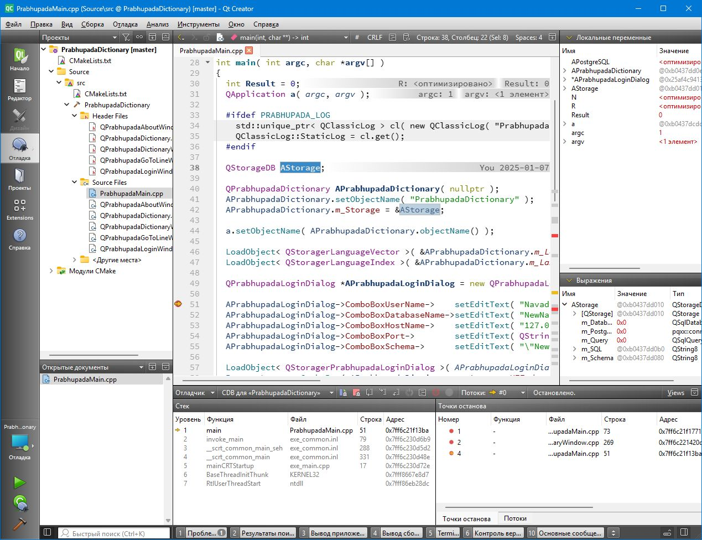

## CopperSpice with NNPrabhupada and NNPrabhupadaDB

Харе Кришна, всем!
Примите, пожалуйста, мои смиренные поклоны!
Слава Шриле Прабхупаде!

### Introduction

### Building

Попробуем собрать Qt и QtCreator и CopperSpice из исходных текстов!
Настроим QtCreator, чтобы можно было писать и отлаживать программы с CopperSpice



Следуем по пути, предначертанном на сайте Qt — https://wiki.qt.io/Building_Qt_6_from_Git .
Установил Far Manager, 7-zip — полезные штуки!

Также хочу заметить, что версии разных продуктов постоянно появляются новые. Устанавливайте новые версии.

1. Устанавливаем PostgreSQL 17 64 bit, качаем отсюда — https://www.postgresql.org/download/windows/ . Путь к  PostgreSQL прописывать в переменной Path не надо, его можно прописать в параметрах CMake сборки Qt. Но перед запуском уже готовых программ, которые скомпилированы с помощью Qt нужно будет срочно добавлять этот путь к системной переменной Path примерно такой командой:
set Path=%Path%;C:\Prg\PostgreSQL\17\bin

2. Качаем и устанавливаем Git отсюда — https://git-scm.com/download/win .
Я разпаковываю в папку C:\Prg\PortableGit . Стараюсь избегать ненужного длинного названия Program Files, с которым не всегда удобно работать. Досталась мне версия PortableGit-2.44.0-64-bit.7z.exe .
В системной переменной Path должно быть следующее: C:\Prg\PortableGit\cmd

3. Устанавливаем CMake, качаем отсюда https://cmake.org/download/ , досталась мне версия cmake-3.28.3-windows-x86_64.zip .
В системной переменной Path должно быть следующее: C:\Prg\cmake-3.28.3-windows-x86_64\bin

4. Устанавливаем Ninja с папку C:\Prg\Ninja . Version 1.11.1
https://github.com/ninja-build/ninja/releases
В системной переменной Path прописываем путь C:\Prg\Ninja .

5. Устанавливаем VulkanSDK
https://vulkan.lunarg.com/sdk/home#windows
Мне досталась версия VulkanSDK-1.3.275.0-Installer.exe . Ни одну дополнительную галочку не выбирал. Установил по минимуму.
В системной переменной Path должно быть следующее: C:\Prg\VulkanSDK\1.3.275.0\Bin
Тут надо пояснить. Я установил две версии VulkanSDK. Одна версия 1.3.275.0 , вторая 1.4.321.1 .
Версия 1.3.275.0 нужна для компиляции CopperSpice
Версия 1.4.321.1 нужна для компиляции CopperSpice
Скоро, я думаю, CopperSpice перейдет на новую версию.
Перед компиляцие я устанавливаю нужную версию в системной переменной Path, а также в системных переменных
VK_SDK_PATH
VULKAN_SDK

6. Устанавливаем Python. Попробуем скачать Windows installer (64-bit)
Stable Releases на странице https://www.python.org/downloads/windows/ .
На данный момент нужно выбрать версию Питона 3.11 python-3.11.8-amd64.exe . Хотя существует более новая версия 3.12, но под неё еще не исправлены исходные тексты Qt. Выбор более ранних версий, тоже приводил к ошибкам компиляции, и некоторые части библиотеки Qt не устанавливались. Оставил все галочки установки по умолчанию. В системную переменную PATH добавил вручную путь C:\Prg\Python\Python311
Установил вручную в Реестре Windows флаг HKEY_LOCAL_MACHINE\SYSTEM\CurrentControlSet\Control\FileSystem\LongPathsEnabled  в значение 1. Питон вроде бы предлагает это сделать при установке. Если забыли сразу включить, то ничего страшного — никогда не поздно. Программа для работы с реестром Виндовс — regedit.exe .

7. Устанавливаем в Питоне html5lib и spdx-tools, для этого переходим в папку C:\Prg\Python\Python313\Scripts и запускаем команду:
pip3 install html5lib spdx-tools spdx

8. Устанавливаем Visual Studio 2022. Качаем отсюда — https://visualstudio.microsoft.com/ru/vs/whatsnew/
Установил поддержку классических приложений C++, мобильных приложений для C++ и два языковых пакета — английский и русский!

9. Установил WDK Для этого скачал wdksetup.exe . Найти можно на странице https://learn.microsoft.com/en-us/windows-hardware/drivers/download-the-wdk#download-icon-for-wdk-step-3-install-wdk . После этого будет доступен отладчик cdb.exe . Он понадобится для работы отладки кода в QtCreator. Находится отладчик тут — D:\Program Files (x86)\Windows Kits\10\Debuggers\x64\cdb.exe . Но QtCreator cfv его найдет!

10. Устанавливаем Win Flex Bizon, качаем отсюда — https://sourceforge.net/projects/winflexbison/
В системную переменную Path добавил следующее: C:\Prg\Win_Flex_Bizon

11. https://nodejs.org/en/download
Мне досталась версия node-v18.18.2-x64.msi . Вместе с node.js не стал устанавливать Шоколадку, которая тянет много пакетов. Эти пакеты плохо контролируются. Еще один Питон! Зачем? Когда удалил все пакеты Chocolatey, но консоль Visual Studio 2022 для режима x64 перестала правильно запускаться. Так что Chocolatey не стал устанавливать.

12. Устанавливаем libclang отсюда — https://download.qt.io/development_releases/prebuilt/libclang/
Мне досталась версия libclang-release_18.1.0-based-windows-vs2019_64.7z
Распаковываем в папку C:\Prg\libclang_vs
В системную переменную Path не надо добавлять этот путь. Сразу в параметрах CMake пропишем, равно как и путь к PostgreSQL!

13. Нужно установить gperf. Скачал отсюда
https://sourceforge.net/projects/gnuwin32/files/gperf/
не самую свежую версию gperf-3.0.1.exe и установил её в папке C:\Prg\GnuWin32
В системную переменную Path прописал путь C:\Prg\GnuWin32\bin

14. Установил OpenSSL . Её требовала CopperSpice — библиотека, которая давным давно отпочковалась от Qt. Сам Qt её не требует. Качать можно отсюда — https://github.com/CristiFati/Prebuilt-Binaries/tree/master/OpenSSL/
Мне досталась версия OpenSSL-3.2.1-Win-pc064.zip . Распаковываем OpenSSL в каталог C:\Prg\OpenSSL\3.2.1

15. В системную переменную Path добавить путь к библиотеке Qt, чтобы другие программы, написанные на Qt могли запускаться. У меня этот путь такой:
D:\QtSource\ReleaseVS\Lib\bin

16. Теперь перейдём к закачке исходных текстов Qt.
Исходники Qt будем записывать в папку D:\QtSource\qt6 .
Для этого в командной строке (я пользуюсь Far Manager) сделаем текущим каталог D:\QtSource\ и запустим команду:
git clone git://code.qt.io/qt/qt5.git qt6
либо эту
git clone https://code.qt.io/qt/qt5.git qt6
перейдем в каталог D:\QtSource\qt6 командой
cd qt6
тут мы можем перейти в нужную ветку Qt. По умолчанию мы попадаем в ветку разработчиков dev, можно включить другую ветку, если Вы знаете её имя. Команда переключения веток такая:
git switch dev
на текущий момент выбрал версию
git switch 6.9.2
потом запустим команду:
init-repository.bat
Она скачает все исходные тексты.
Если не сработает, то выполнить команду
git remote -v
в папке Qt6
Скорее всего она посоветует выпонить команду
git config --global --add safe.directory C:/QtSource/qt6
Выполните её! И init-repository.bat будет работать очень хорошо!

17. Теперь перейдём к закачке исходных текстов QtCreator.
Перейдем в каталог D:\QtSource
Запускаем команду
git clone git://code.qt.io/qt-creator/qt-creator.git
или такую
git clone https://code.qt.io/qt-creator/qt-creator.git
потом выполнить
cd qt-creator
возможно придется выполнить
git remote -v
git config --global --add safe.directory D:/QtSource/qt-creator
выполнить
git submodule update --init --recursive

18. Теперь перейдем к очень важному этапу создания нужных папок!
У нас уже есть каталог D:\QtSource
В нем есть каталог D:\QtSource\qt6, в который мы закачали исходные тексты Qt
Также в нём есть D:\QtSource\qt-creator , в который мы закачали исходные тексты QtCreator.
Создадим каталог D:\QtSource\Bat — в нем будут bat файлы для запуска нужных для компиляции команд.
Создадим каталог D:\QtSource\Log — в нем будут log файлы, в которых будут отображаться весь процесс компиляции Qt.
Создадим каталог qtcreator_build_vs — в нем будет скомпилирован и собран QtCreator с помощью компилятора MSVC, который устаановился вместе с Visual Studio 2022. Можно скомпилировать все и с помощью GCC 11.2, но в этом случае невозможно скомпилировать QtWebEngine и также не получается скомпилировать модуль для PostgreSQL.
Создадим каталоги:
D:\QtSource\ReleaseVS
D:\QtSource\ReleaseVS\Build — тут будут храниться результаты конфигурирования библиотеки Qt
D:\QtSource\ReleaseVS\Lib — тут будет храниться уже готовая к употреблению библиотека Qt

19. Теперь перейдем к очень важному этапу создания нужных файлов! Звёздочки копировать не надо! Они просто служат для обозначения границ — начало файла и конец файла.
Создадим файл D:\QtSource\Bat\LogReleaseVSConfig.bat и запишем его содержимое таким образом:
```bat
ReleaseVSConfig.bat => ./../Log/ReleaseVSConfig.log
```

Создадим файл D:\QtSource\Bat\LogReleaseVSBuild.bat и запишем его содержимое таким образом:
```bat
ReleaseVSBuild.bat => ./../Log/ReleaseVSBuild.log
```

Создадим файл D:\QtSource\Bat\ReleaseVSConfig.bat и запишем его содержимое таким образом:
```bat
set BUILD_DIR=D:/QtSource

cd %BUILD_DIR%/ReleaseVS/Build

%BUILD_DIR%/Qt6/configure.bat -prefix %BUILD_DIR%/ReleaseVS/Lib ^
  -release ^
  -sql-psql ^
  -qt-zlib ^
  -confirm-license ^
  -opensource ^
  -DOPENSSL_ROOT=C:/Prg/OpenSSL/3.4.1 ^
  -- -DCMAKE_PREFIX_PATH=C:/Prg/libclang_vs;C:/Prg/PostgreSQL/17
```

Создадим файл D:\QtSource\Bat\ReleaseVSBuild.bat и запишем его содержимое таким образом:
```bat
rem set Path=%Path%;C:\Prg\PostgreSQL\17;C:\Prg\libclang_vs
set BUILD_DIR=C:/QtSource
cd %BUILD_DIR%/ReleaseVS/Build
cmake —build . —parallel 5
cd %BUILD_DIR%/ReleaseVS/Build
cmake —install .
```

Создадим файл D:\QtSource\Bat\Log-qt-creator-build-vs.bat и запишем его содержимое таким образом:
```bat
qt-creator-build-vs.bat => ./../Log/qt-creator-build-vs.log
```

Создадим файл D:\QtSource\Bat\qt-creator-build-vs.bat и запишем его содержимое таким образом:
```bat
set BUILD_DIR=D:\QtSource\qtcreator_build_vs
cd %BUILD_DIR%

cmake -DCMAKE_BUILD_TYPE=Release -G Ninja ^
  -DCMAKE_PREFIX_PATH=D:\QtSource\ReleaseVS\Lib;C:\Prg\libclang_vs ^
  D:\QtSource\qt-creator

cmake --build . --parallel

cd %BUILD_DIR%

cmake --install .```
```

20. Теперь мы должны запустить терминал (консоль), но не просто любую командную оболочку, а ту которую предоставила нам программа Visual Studio 2022. Я выбрал x64 Native Tools. У меня этот ярлык находится тут:
D:\ProgramData\Microsoft\Windows\Start Menu\Programs\Visual Studio 2022\Visual Studio Tools\VC\x64 Native Tools Command Prompt for VS 2022.lnk
Для удобства я его закрепил на панели задач, так как приходится часто его нажимать. Обычно я сразу же перехожу в каталог Far Manager и запускаю его. Так удобнее. Например так:
cd D:\P + клавиша Tab — получаем cd D:\Prg, набираем символы \f и нажимаем клавишу Tab, получаем cd C:\Prg\Far Manager, нажимаем Enter, набираем Far и снова нажимаем Enter — вот Far Manager и запустился.
Если же мы выберем другую архитектуру компилятора, наприме x86_x64, то мы тоже сможем скомпилировать библиотеку Qt и в ней, но в этом случае на неудастся соединиться с сервером PostgreSQL при помощи его родных библиотек, как например C:\Prg\PostgreSQL\16\bin\libpq.dll и подобных. Для успешного соединения нам, вероятней всего понадобится набор таких библиотек, скомпилированных именно для архитектуры x86_x64.
Также необходимо перевести консоль в utf-8 командой
chcp 65001

Для удобства я сделал bat файл D:\CopperSpice\Bat\StartFar.bat
```bat
chcp 65001
C:\Prg\Far\Far.exe
```
Он сразу переводит консоль в utf-8 и запускает Far Manager
Сразу скажу, что для компиляции Qt я запускаю консоль в режиме адиминистратора, а для компиляции CopperSpice достаточно обычного запуска консоли. QtCreator пишет файлы в каталог "C:\Program Files (x86)\QtCreator". Для этого нужны полномочия Адиминистратора.

21. Столкнулся с неприятной проблемой компиляции, которая требует установки zstd
я скачал zstd-v1.5.7-win64.zip отсюда
https://github.com/facebook/zstd/releases
В переменную PATH добавил строку C:\Prg\zstd-v1.5.7-win64\dll

22. Теперь просто последовательно запускаем три файла
D:\QtSource\Bat\LogReleaseVSConfig.bat
D:\QtSource\Bat\LogReleaseVSBuild.bat
D:\QtSource\Bat\Log-qt-creator-build-vs.bat
При этом нужно ждать, пока завершится выполнения каждого файла, перед тем как запускать следующий.

Вот и всё! В итоге мы получили рабочую библиотеку Qt и замечательный инструмент Qt Creator! Можно на рабочем столе создать ярлык для запуска Qt Creator и работать по-стахановски. Qt Creator находится здесь — D:\QtSource\qtcreator_build_vs\bin\qtcreator.exe .

Устанавливаем CopperSpice! Каталоги можете выбрать другие.

23. Создаем каталог D:\CopperSpice
24. Выполняем клонирование репозитория CopperSpice командой
для оригинального CopperSpice
git clone https://github.com/copperspice/copperspice Source

для форка CopperSpice
git clone https://github.com/Navadvipa-Chandra-das/copperspice Source

git clone https://github.com/copperspice/cs_designer

git clone https://github.com/copperspice/doxypressapp

Исходные тексты KitchenSink я распоковал в каталог D:/CopperSpicePrg/KitchenSink

25. Создаем каталоги:
D:\CopperSpice\Bat

D:\CopperSpice\Release\Build

D:\CopperSpice\Release\Lib

D:\CopperSpice\Debug\Build

D:\CopperSpice\Debug\Lib

D:\CopperSpice\ReleaseDesigner\Build

D:\CopperSpice\ReleaseDesigner\Lib

D:\CopperSpice\ReleaseDoxypressApp\Build

D:\CopperSpice\ReleaseDoxypressApp\Lib

D:\CopperSpice\ReleaseKitchenSink\Build

D:\CopperSpice\ReleaseKitchenSink\Lib

26. Создаем файлы:
D:\CopperSpice\Bat\Release.bat 
```bat
set BUILD_DIR=D:/CopperSpice

cd %BUILD_DIR%/Release/Build

cmake -G "Ninja" ^
  -DCMAKE_BUILD_TYPE=Release ^
  -DCMAKE_INSTALL_PREFIX=%BUILD_DIR%/Release/Lib ^
  -DOPENSSL_ROOT=C:/Prg/OpenSSL/3.4.1 ^
  -Dlibpqxx_DIR="D:/CopperSpice/ReleaseLibpqxx/Lib/lib/cmake/libpqxx" ^
  -DPostgreSQL_ROOT=C:/Prg/PostgreSQL/17 ^
  %BUILD_DIR%/Source

ninja

ninja install
```

D:\CopperSpice\Bat\Debug.bat 
```bat
set BUILD_DIR=D:/CopperSpice

cd %BUILD_DIR%/Debug/Build

cmake -G "Ninja" ^
  -DCMAKE_BUILD_TYPE=Debug ^
  -DCMAKE_INSTALL_PREFIX=%BUILD_DIR%/Debug/Lib ^
  -DOPENSSL_ROOT_DIR=C:/Prg/OpenSSL/3.4.0 ^
  -DPostgreSQL_ROOT=C:\Prg\PostgreSQL\17 ^
  %BUILD_DIR%/Source

ninja

ninja install
```

D:\CopperSpice\Bat\ReleaseDesigner.bat 
```bat
set BUILD_DIR=D:/CopperSpice/ReleaseDesigner/Build

cd %BUILD_DIR%
cmake -G "Ninja" -DCMAKE_BUILD_TYPE=Release ^
-DCMAKE_INSTALL_PREFIX="D:/CopperSpice/ReleaseDesigner/Bin" ^
-DCMAKE_PREFIX_PATH="D:/CopperSpice/Release/Lib/cmake/CopperSpice" ^
D:/CopperSpice/cs_designer

cd %BUILD_DIR%
ninja -v

cd %BUILD_DIR%
ninja -v install
```

D:\CopperSpice\Bat\ReleaseDoxypressApp.bat 
```bat
set BUILD_DIR=D:/CopperSpice/ReleaseDoxypressApp/Build

cd %BUILD_DIR%
cmake -G "Ninja" -DCMAKE_BUILD_TYPE=Release ^
-DCMAKE_INSTALL_PREFIX="D:/CopperSpice/ReleaseDoxypressApp/Bin" ^
-DCMAKE_PREFIX_PATH="D:/CopperSpice/Release/Lib/cmake/CopperSpice" ^
D:/CopperSpice/doxypressapp

cd %BUILD_DIR%
ninja -v

cd %BUILD_DIR%
ninja -v install
```

D:\CopperSpice\Bat\ReleaseKitchenSink.bat 
```bat
set BUILD_DIR=D:/CopperSpice/ReleaseKitchenSink/Build

cd %BUILD_DIR%
cmake -G "Ninja" -DCMAKE_BUILD_TYPE=Release ^
-DCMAKE_INSTALL_PREFIX="D:/CopperSpice/ReleaseKitchenSink/Bin" ^
-DCMAKE_PREFIX_PATH="D:/CopperSpice/Release/Lib/cmake/CopperSpice" ^
D:/CopperSpicePrg/KitchenSink

cd %BUILD_DIR%
ninja -v

cd %BUILD_DIR%
ninja -v install
```

25. Смотри пенкт 21.
Теперь мы должны запустить терминал (консоль), но не просто любую командную оболочку, а ту которую предоставила нам программа Visual Studio 2022. Я выбрал x64 Native Tools. У меня этот ярлык находится тут:
D:\ProgramData\Microsoft\Windows\Start Menu\Programs\Visual Studio 2022\Visual Studio Tools\VC\x64 Native Tools Command Prompt for VS 2022.lnk

Выполним команду:
cd D:\CopperSpice\Bat 

Можно запустить
Release.bat 
или
Release.bat > Release.log
для удобного просмотра лог-файла.
Эта команда установит Release версию CopperSpice

Команда
Debug.bat > Debug.log
установит Debug версию CopperSpice

Команда
ReleaseDesigner.bat > ReleaseDesigner.log
установит D:\CopperSpice\ReleaseDesigner\Bin\Designer.exe

Команда
ReleaseDoxypressApp.bat > ReleaseDoxypressApp.log
Установит D:\CopperSpice\ReleaseDoxypressApp\Bin\DoxyPressApp.exe

Команда
ReleaseKitchenSink.bat > ReleaseKitchenSink.log
Установит DoxyPressApp.exe
D:\CopperSpice\ReleaseKitchenSink\Bin\KitchenSink.exe

26. Установим официальный клиент PostgreSQL для C++ - libpqxx !
cd D:\CopperSpice
git clone https://github.com/jtv/libpqxx

27. Создадим каталоги (папки)
D:\CopperSpice\ReleaseLibpqxx\Build
D:\CopperSpice\ReleaseLibpqxx\Lib

29. Создадим файл
D:\CopperSpice\Bat\ReleaseLibpqxx.bat 
```bat
set BUILD_DIR=D:/CopperSpice

cd %BUILD_DIR%/ReleaseLibpqxx/Build

cmake -G "Ninja" ^
  -DCMAKE_BUILD_TYPE=Release ^
  -DCMAKE_INSTALL_PREFIX=%BUILD_DIR%/ReleaseLibpqxx/Lib ^
  -DPostgreSQL_ROOT=C:\Prg\PostgreSQL\17 ^
  %BUILD_DIR%/libpqxx

ninja

ninja install
```
30. Выполним команды
cd D:\CopperSpice\Bat
ReleaseLibpqxx.bat > ReleaseLibpqxx.log

Харе Кришна!
С уважением, Навадвипа Чандра дас.

## CopperSpice

### Introduction

CopperSpice is a set of individual libraries which can be used to develop cross platform software applications in C++.
It is a true open source project released under the LGPL V2.1 license and was initially derived from the Qt framework.

CopperSpice has diverged to become a modern representation of what can be accomplished with C++. Our goal and intention
is to provide a first class GUI library to unite the C++ community.

Our motivation for developing CopperSpice was to change the fundamental design and turn the existing framework into a
set of libraries for C++ developers. We are accomplishing this by leveraging modern C++ functionality, new technology,
and modern tooling.

The libraries available in CopperSpice include:

 * CsCore
 * CsGui
 * CsMultimedia
 * CsNetwork
 * CsOpenGL
 * CsSql
 * CsSvg
 * CsVulkan
 * CsWebKit
 * CsXml
 * CsXmlPatterns

There are also several open source BSD licensed libraries which are used by CopperSpice and available as stand
alone libraries for anyone developing C++ applications.

 * CsCrypto
 * CsLibGuarded
 * CsPaint
 * CsPointer
 * CsSignal
 * CsString


### System Requirements

Building CopperSpice requires a C++20 compiler and a C++20 standard library.

CMake build files are provided with the source distribution to build this library. The unit test binary executable is
an optional part of the build process.

This library has been tested with clang sanitizer and an extensive industry code review.


### Using the CopperSpice Libraries

 * Any C++ application using CopperSpice can be built with CMake or any build system which imports CMake files

 * We recommend your software application use CMake and Ninja for the build system

 * CopperSpice can be linked directly into any standard C++ application

 * KitchenSink is a demo application which contains over 30 examples of the basic functionality available in CopperSpice


### Documentation

###### Overview

The CopperSpice Overview documentation includes information on building CopperSpice, downloading prebuilt binary
files, package requirements, setting up an application which links with CopperSpice, migrating to CopperSpice, and
general configuration information.

https://www.copperspice.com/docs/cs_overview/index.html


###### API

The API contains full class documentation and multiple tutorials for CopperSpice and is available directly on our
website and from our download page.

https://www.copperspice.com/docs/cs_api/index.html


###### Offline

Both the CS Overview and API documentation can be downloaded for offline use. They are available in a compressed tar file
or zip format.

https://download.copperspice.com/copperspice/documentation


### Major Enhancements

* Reflection (run time and compile time)
  * No Meta-Object Compiler is required for generating meta data, all references were removed
  * The functionality provided by moc was replaced with compile time templates
  * CopperSpice automatically generates meta data for processing Signals/ Slots and Introspection
  * Template classes can inherit from QObject with no restrictions on types
  * Complex data types such as **QMap&lt;QString, int&gt;** can be used for signal or slot arguments
<!-- -->
* Enhanced Functionality
  * CopperSpice makes extensive use of modern C++ features
    * constexpr, lambda expressions, templates, variadic templates, template variables
    * move semantics, structured bindings, tuple,  decltype, SFINAE, and type traits
  * Redesigned all container classes to use the C++ standard library containers, iterators, and algorithms
  * Refactored all Mutex and Lock classes
  * CopperSpice includes a majority of the Qt 5 classes
  * Platform independent plugin system based on standard C++
  * High DPI Rendering Support
  * Full support for the Vulkan Graphics API
<!-- -->
* Integration of CsLibGuarded
  * Used to manage shared data
  * Provides functionality to associate a mutex with the data it protects
<!-- -->
* Integration of CsSignal
  * Improved thread aware Signal/Slot delivery
  * Increased efficiency while maintaining the full Signal/Slot API
  * Deadlocks in Signal/Slot processing have been eliminated
<!-- -->
* Integration of CsString
  * Improved storage to properly represent Unicode strings
  * QString8 (UTF-8) and QString16 (UTF-16) classes
  * Added QStringView, QStringParser, and QRegularExpression
<!-- -->
* Integration of CsPointer
  * Leverages the C++ pointer classes, adds additional functionality


### Presentations

Our YouTube channel contains over 75 videos about C++, programming fundamentals, Unicode/Strings, multithreading,
graphics, CopperSpice, DoxyPress, and other software development topics.

https://www.youtube.com/copperspice

Links to additional videos can be found on our website.

https://www.copperspice.com/presentations.html


### Authors and Key Contributors

The CS team welcomes contributors of all skill levels. When submitting a pull request please observe our
Coding Style Guidelines.

https://www.copperspice.com/style_guide/source_code_style.html


* **Ansel Sermersheim**
* **Barbara Geller**
* **Jan Wilmans**
* **Tim van Deurzen**
* **Paul Bendixen**
* **Peter Bindels**
* **Mortaro Marcello**
* **Adam Mensel**
* **Robin Mills**
* **Ivailo Monev**
* **Adam Mensel**
* **Matan Nassaw**
* **Jeff Cohen**
* **Daniel Pfeifer**
* **Zbigniew Skowron**
* **Johan Förberg**
* **Dennis Menschel**


### License

This library is released under the LGPL V2.1 license. For more information refer to the LICENSE file provided with
this project.


### References

 * Website:  https://www.copperspice.com
 * Twitter:  https://twitter.com/copperspice_cpp
 * Email:    info@copperspice.com

<!-- -->
 * Github:   https://github.com/copperspice

<!-- -->
 * Forum:    https://forum.copperspice.com
 * Journal:  https://journal.copperspice.com
